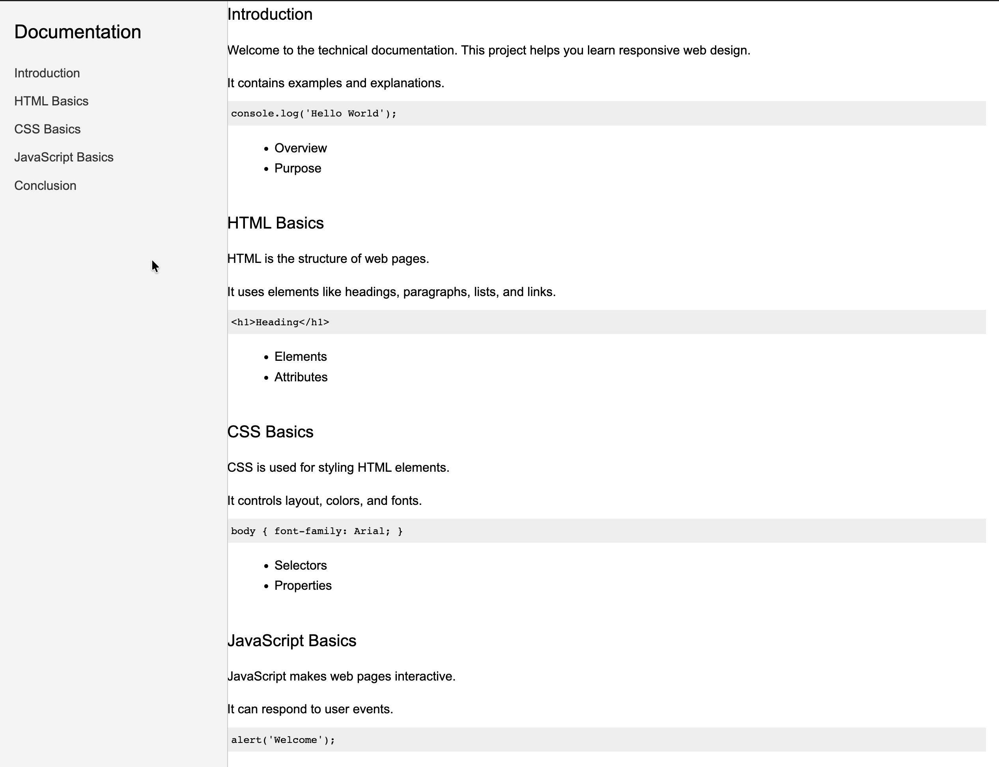

# Technical Documentation Page

## Description
This project is a **responsive technical documentation webpage** built with **HTML and CSS**. It is designed to provide clear and structured documentation for web development topics.

The page features a fixed **left-hand navbar** that links to multiple sections of the content, allowing easy navigation and accessibility.

## Features
- 5 main content sections with unique IDs
- Fixed left-side navigation bar
- Interactive `.nav-link` anchors for smooth navigation
- Example `<code>` blocks and `<ul>` lists for documentation content
- Mobile-friendly layout via media queries

## Technologies Used
- HTML5  
- CSS3  
- Responsive design techniques

